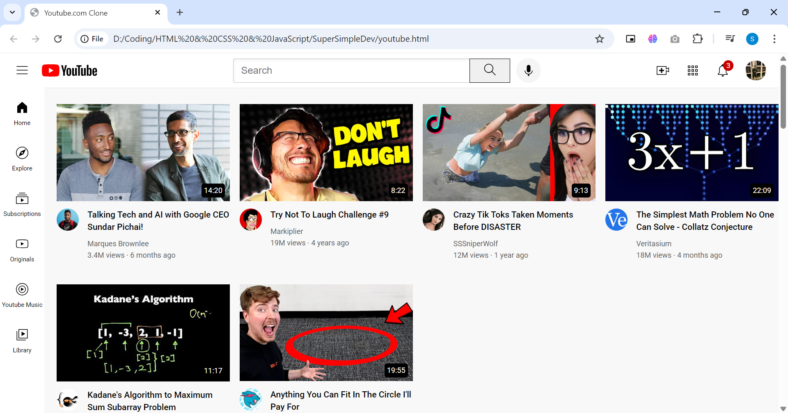

# YouTube Homepage Clone (HTML + CSS)

This is a **static YouTube homepage clone** I built while learning the fundamentals of HTML and CSS. No JavaScript, no frameworks—just raw structure and styling. The idea was to mimic YouTube’s layout closely enough to understand how real-world UI comes together.

## 🌱 What I Learned

- How to break down a complex layout like YouTube’s into manageable components
- How to use Flexbox and Grid together
- Positioning elements like headers, sidebars, and tooltips
- Styling interactive UI elements like buttons and hover tooltips
- Media queries for basic responsiveness

## 📁 Folder Structure

project/ 
│ 
├── youtube.html 
├── Styles/ 
│ ├── general.css 
│ ├── header.css 
│ ├── sidebar.css 
│ └── video.css 
├── icons/ 
├── thumbnails/ 
└── channel-pictures/ 

> Note: Images and icons used here are for educational purposes only.

## 🎥 Live Demo / Walkthrough

I’ll be adding a quick walkthrough video soon showing how everything works.  
**[Watch it here once it's ready →](#)**

## ⚙️ How to Run It

1. Clone the repo
2. Open `youtube.html` in any browser
3. That’s it — no setup needed.

## 💬 Why This Project

YouTube has a clean but detailed interface. Trying to recreate it without JavaScript forced me to pay attention to detail: spacing, alignment, layout structure, and how elements behave in different screen sizes.

It’s not a perfect replica — but that wasn’t the point. The goal was to learn, build, and improve.

## 🧠 Next Steps

- Add interactivity using JavaScript
- Make it more responsive for tablets and phones
- Try rebuilding this with a frontend framework like React

## 📌 Credits

- Inspired by the real YouTube.com UI
- Thumbnails and channel images used from actual YouTube videos for educational demo only

## 🛠 Built With

- HTML5
- CSS3 (Flexbox + Grid)
- Google Fonts (Roboto, Montserrat)

---

If you’ve got feedback or suggestions, I’m all ears.
